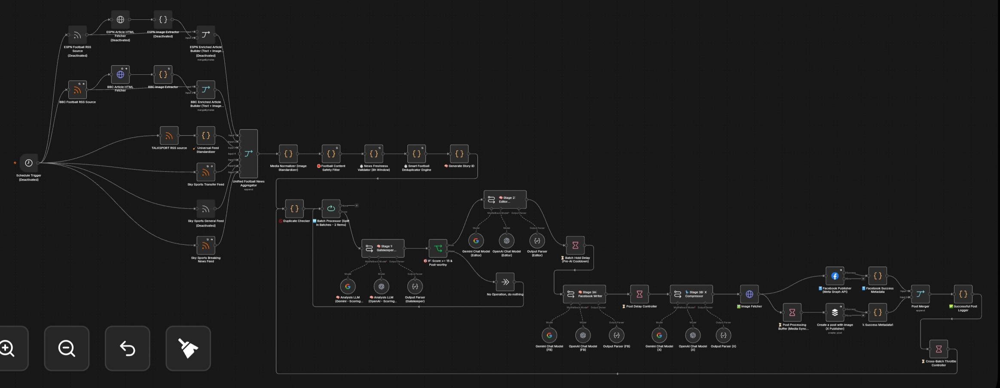
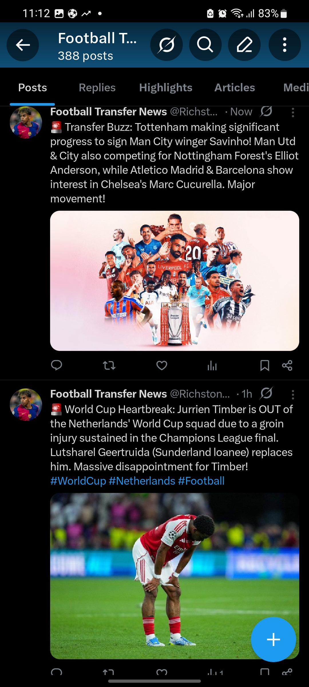

# AI-Powered Football News Automation & Distribution System ⚽🤖



An automated football news processing and publishing system built with n8n. It is designed to collect football news from multiple RSS sources, validate and filter stories, detect duplicates, use AI to evaluate content, retrieve media, and prepare qualifying stories for automated social media distribution.

## 📌 Overview

This project demonstrates how an end-to-end, multi-agent AI content automation pipeline can be built using n8n.

Instead of manually monitoring multiple football news sources, selecting stories, checking whether they are recent or duplicated, evaluating their relevance, finding suitable media, and preparing them for publication, the workflow handles these stages autonomously.

The goal is to create a reliable pipeline that continuously processes incoming football stories while eliminating repetitive manual work and preventing AI hallucinations.

## 🔄 What the Workflow Does

At a high level, the automation follows this process:

Football RSS Sources
        ↓
News Aggregation
        ↓
Media Normalization
        ↓
Freshness Validation
        ↓
Smart Deduplication
        ↓
Batch Processing
        ↓
AI Content Analysis (Multi-Agent)
        ↓
Engagement / Post-Worthiness Filter
        ↓
Image Retrieval
        ↓
Publishing
        ↓
Success / Error Handling
        ↓
Logging & Global State Metadata


The workflow is designed around a simple principle:
**« Collect → Clean → Validate → Deduplicate → Analyze → Filter → Enrich → Publish → Log »**

## ✨ Key Features

📰 **Multi-Source Football News Aggregation**

Collects football stories from 6 configured RSS feeds (ESPN, BBC, Sky Sports, TalkSport) concurrently, allowing multiple sources to be processed through a unified pipeline.

🧹 **Content Normalization & Sanitization**

Incoming RSS HTML is stripped, annoying double-slash URLs are corrected, and nested thumbnail images are hunted down via a custom fallback hierarchy (OpenGraph tags → `` Regex parsing).

⏱️ **Freshness Validation & Safety Filter**

Stories are checked against a strict 8-hour freshness window. A custom safety filter drops content containing banned keywords (betting, odds, live streams) before it wastes LLM tokens.

🔍 **Smart Deduplication**

Features a custom JavaScript deduplication engine designed to identify substantially similar football stories across different publishers. It executes football-specific normalization: parsing Canonical Club Aliases (e.g., mapping "Man City" to "Manchester City") and using Regex to extract Capitalized Player Names *before* casting to lowercase.

🤖 **AI-Assisted Analysis (Multi-Agent Chain)**

Rather than one massive prompt, the system chains distinct LLMs (Gemini/OpenAI):

* **The Editor:** Extracts strict facts with a "zero-hallucination" constraint.
* **The FB Writer:** Formats high-engagement Facebook copy with hooks and hashtags.
* **The X Compressor:** Shrinks the output to fit a punchy 245-character X (Twitter) limit.

📊 **Engagement Filtering (The Gatekeeper)**

An AI Agent acts as an editorial desk, scoring incoming articles out of 20 points based on headline appeal, timeliness, and fan impact. Only content scoring ≥15 continues to publishing.

🚀 **Automated Distribution with API Throttling**

Publishes approved content to Meta (Facebook Graph API) and X (Buffer API). It utilizes `Wait` nodes (cross-batch throttles and media sync delays) to respect strict social media rate limits.

📝 **Global State Logging & Metadata**

Includes success/error handling that writes successful post IDs directly to n8n's `$getWorkflowStaticData('global')`. This memory array is capped at 100 entries, allowing the bot to "remember" what it posted yesterday and guarantee zero duplicate posts over time.

## 🧠 Why I Built This

This project was created to explore how AI, APIs, custom data structures, and workflow automation can be combined to build a practical content-distribution system.

The main challenge was *not* simply getting an AI model to generate a football post. The larger challenge was building a backend pipeline capable of deciding:

* What news is new?
* What stories are duplicates?
* Is the story actually relevant?
* Is it worth posting?
* What information should be extracted?
* What media should accompany it?
* Should it continue to the publishing stage?
* Was the publishing operation successful?

This project therefore focuses heavily on **automation architecture and programmatic decision-making**, rather than simply AI text generation.

## 🛠️ Technologies Used

* **n8n** — Workflow automation and orchestration
* **JavaScript (Node.js)** — Custom deduplication logic and data transformation
* **AI/LLM** — Google Gemini & OpenAI API for multi-agent content analysis
* **RSS** — Automated news ingestion
* **Meta Graph API** — Facebook publishing
* **Buffer API** — X (Twitter) distribution

## 🏆 Proof of Execution

Here are live examples of the fully automated output published directly to Facebook and X:




## 🚀 Setup Instructions

1. **Import Workflow:** Download `workflow/football-news-automation.json` and import it into your n8n workspace.
2. **Configure Credentials:** Add your own OpenAI/Gemini API keys, Meta Graph API Token, and Buffer API Token in the n8n credentials manager.
3. **Activate:** Toggle the workflow to **Active**. The cron trigger will run automatically at 06:00, 10:00, 14:00, 18:00, and 22:00.

**Author:** Ayoola Peter Olamilekan ([@Oppy001](https://www.google.com/search?q=https://github.com/Oppy001))

*AI Automation Specialist & System Architect*

```
