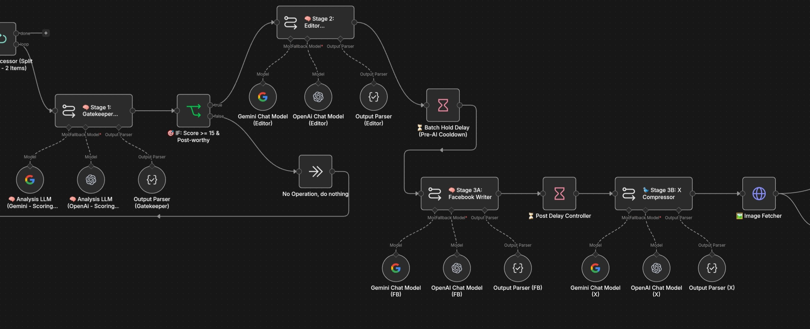
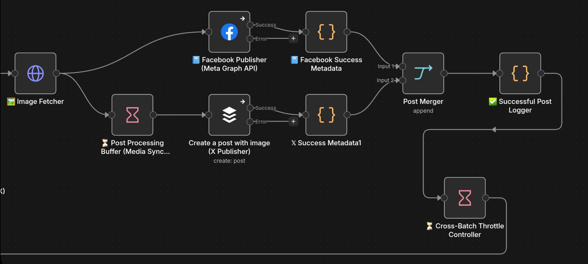

# System Architecture & Pipeline Design

The Football News Automation Workflow is an event-driven content processing pipeline built with n8n. Its purpose is to collect news from multiple RSS sources, enrich the data, deterministically strip duplicates, evaluate stories using AI, generate platform-specific content, and distribute approved posts.

## 🧭 Core Architectural Principles

Before examining the nodes, it is important to understand the design philosophy behind this pipeline:

1. **Filter Before Generate:** Unwanted, stale, or irrelevant stories are removed via code *before* they ever reach the AI layer, saving token costs and execution time.
2. **Deterministic Processing Before AI:** Traditional JavaScript handles tasks that require strict logic (Date validation, Entity normalization, Deduplication). AI is reserved exclusively for tasks requiring semantic understanding.
3. **AI as a Decision Layer:** The LLM is not just a text generator; it is the ultimate editorial gatekeeper, deciding *if* a story is worth publishing based on a 20-point scoring matrix.
4. **Controlled Execution:** Batching, wait-timers, and throttling are heavily utilized to prevent API rate limits and control the workload.

---

## 1. Ingestion, Filtering & Smart Deduplication


The workflow begins by polling 6 distinct RSS feeds on a cron schedule (`0 6,10,14,18,22 * * *`). It does not immediately publish data; instead, it enters a rigorous sanitization pipeline:

* **Media Normalization:** Standardizes missing images via OpenGraph or `` tag extraction.
* **Freshness & Safety:** Discards articles older than 8 hours and drops content containing banned keywords (e.g., betting, predictions).
* **Smart Deduplication Engine:** A custom JavaScript module that normalizes club aliases ("Man City" → "Manchester City") and detects capitalized player names via Regex *before* creating a composite deduplication key. This ensures the same story from BBC and ESPN is only processed once.

---

## 2. Multi-Agent AI Chain



Approved stories are batched (2 at a time) and passed to the LLM orchestration layer.

* **Agent 1: The Gatekeeper (Scoring):** Evaluates the raw article out of 20 points (Headline Appeal, Relevance, Impact, Engagement). Only articles returning the exact string `"Post-worthy"` (Score ≥ 15) proceed.
* **Agent 2: The Editor:** A "zero-hallucination" extractor that generates a factual 50–250 word summary strictly constrained to the source text.
* **Agent 3 & 4: Platform Writers:** Parallel agents take the editorial summary and branch out. One generates high-engagement Facebook copy, while the other shrinks the output to a punchy 245-character X (Twitter) format.

---

## 3. Throttling, Publishing & State Logging



The architecture separates the content-generation logic from the physical publishing mechanism to handle API constraints cleanly.

* **Throttling Controllers:** Pre-AI cooldowns (10s), media sync delays (1m), and cross-batch throttles (1.5m) ensure that Facebook Graph API and Buffer API are never overwhelmed.
* **Global State Memory:** Successful metadata (Post IDs, Platforms) are passed to a final Javascript node that writes to n8n's `$getWorkflowStaticData('global')`. This caps at 100 entries, providing the bot with a permanent memory of what it has already published to guarantee zero overlap across days.

---

## 📊 Complete Data Flow Summary

```text
RSS SOURCES
      ↓
SOURCE-SPECIFIC ENRICHMENT
      ↓
UNIFIED AGGREGATOR
      ↓
CONTENT SAFETY & FRESHNESS
      ↓
SMART DEDUPLICATION (JS Engine)
      ↓
BATCH PROCESSING
      ↓
AI SCORING / GATEKEEPER
      ↓
EDITORIAL SUMMARY (Zero-Hallucination)
      ├──────────────────┐
      ↓                  ↓
FACEBOOK WRITER    X COMPRESSOR
      └────────┬─────────┘
               ↓
          IMAGE FETCH
         ┌─────┴─────┐
         ↓           ↓
     FACEBOOK      BUFFER
    PUBLISHER     PUBLISHER
         ↓           ↓
      SUCCESS METADATA
         └─────┬─────┘
               ↓
     GLOBAL STATE LOGGING
